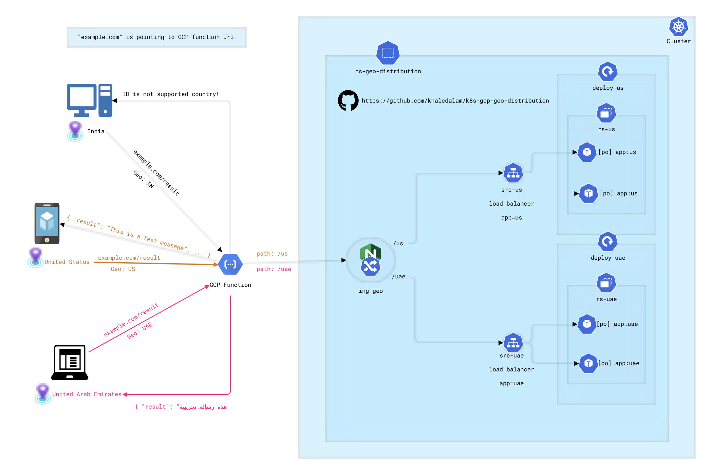

# k8s-gcp-geo-distribution

Routing traffic based on user geo-location using Kubernetes(K8s) and Google Cloud Platform(GCP) infrastructure.


[](https://hub.docker.com/r/khaledalam/k8s-gcp-geo-distribution/)
[](https://hub.docker.com/r/khaledalam/k8s-gcp-geo-distribution/)


APP has 2 different versions (determined by env var `APP_COUNTRY`) Override by K8s(`spec.containers.env`):
- US 
- UAE

Each version placed on a K8s deployment<->service.

### Diagram:


K8s resources:
```
NAME                              READY   STATUS    RESTARTS   AGE
pod/deploy-uae-5979b498c4-267r4   1/1     Running   0          9s
pod/deploy-uae-5979b498c4-r986l   1/1     Running   0          9s
pod/deploy-us-77db5f8549-mrtpc    1/1     Running   0          9s
pod/deploy-us-77db5f8549-xv57c    1/1     Running   0          9s

NAME              TYPE           CLUSTER-IP       EXTERNAL-IP   PORT(S)        AGE
service/srv-uae   LoadBalancer   10.108.10.19     <pending>     80:30730/TCP   9s
service/srv-us    LoadBalancer   10.105.232.173   <pending>     80:31591/TCP   9s

NAME                         READY   UP-TO-DATE   AVAILABLE   AGE
deployment.apps/deploy-uae   2/2     2            2           9s
deployment.apps/deploy-us    2/2     2            2           9s

NAME                                    DESIRED   CURRENT   READY   AGE
replicaset.apps/deploy-uae-5979b498c4   2         2         2       9s
replicaset.apps/deploy-us-77db5f8549    2         2         2       9s

NAME                                CLASS   HOSTS                 ADDRESS   PORTS   AGE
ingress.networking.k8s.io/ing-geo   nginx   k8s-ingress-url.com             80      9s
```


Routing:
- 1st method: `(costly solution)`
    - Used GCP function and node package [geoip-lite](https://github.com/geoip-lite/node-geoip)(based on maxmind) for locating the user ip country and routing the traffic to k8s ingress paths `/us` or `/uae`.
      - GCP function 2nd-gen has more `Runtime, build, connections and security settings` such as Concurrency(Maximum concurrent requests per instance).
  - Improvements:
    - Replace GCP function with lower price solution
    - DB update mechanism, Caching maxmind calls, ..
    - ...
- Other methods: `investigating ingress-nginx custom annotation and other solutions`